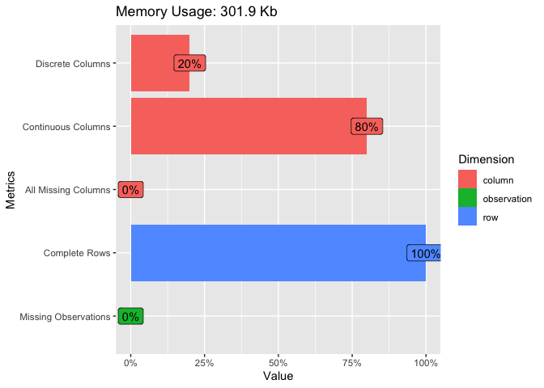

# TELECOM CHURN PREDICTION

We will try to some predictions. The Orange telecom’s churn dataset have
been uploaded from Kaggle and you can easily access to it by clicking to
this
[link](https://www.kaggle.com/mnassrib/telecom-churn-datasets "link to the dataset")

## Loading all packages

    library(ggplot2)
    library(tidyverse)
    library(tidymodels)
    library(parsnip)
    library(yardstick)
    library(workflowsets)
    library(dplyr)
    library(DataExplorer)

## import our data

You can also embed plots, for example:

## Exploratory Data Analysis

Now, let’s see under the wood all the features

    plot_intro(churn)

