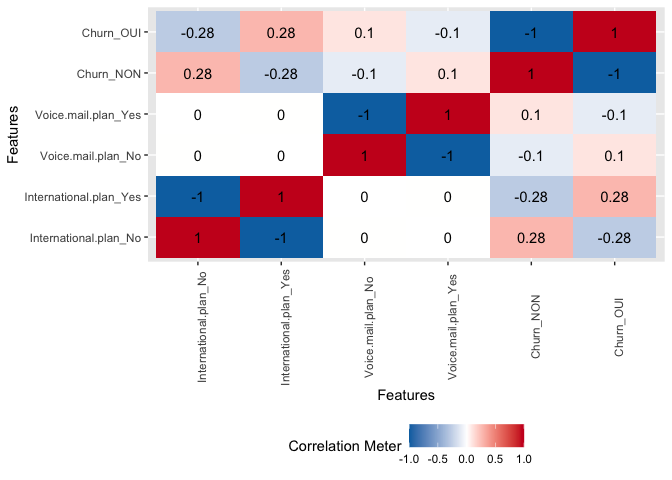

# TELECOM CHURN PREDICTION

We will try to some predictions. The Orange telecom’s churn dataset have
been uploaded from Kaggle and you can easily access to it by clicking to
this
[link](https://www.kaggle.com/mnassrib/telecom-churn-datasets "link to the dataset")

## Loading all packages

    library(ggplot2)
    library(tidyverse)
    library(tidymodels)
    library(parsnip)
    library(yardstick)
    library(workflowsets)
    library(dplyr)
    library(DataExplorer)
    library(kknn)
    library(themis)
    library(glmnet)
    library(rpart)
    library(readr)
    library(kableExtra)

## import our data

    churn<- read.csv("https://raw.githubusercontent.com/36006509/telecom_churn-repo/main/churn-bigml-80.csv",stringsAsFactors = TRUE)
    #churn[is.double(churn)]<- as.integer(churn[is.double(churn)])
    #churn[is.integer(churn)]<- as.numeric(churn[is.integer(churn)])
    churn$Churn<-if_else(churn$Churn=="False","NON","OUI")
    churn$Churn<- as.factor(churn$Churn)
    str(churn)

    ## 'data.frame':    2666 obs. of  20 variables:
    ##  $ State                 : Factor w/ 51 levels "AK","AL","AR",..: 17 36 32 36 37 2 20 25 50 40 ...
    ##  $ Account.length        : int  128 107 137 84 75 118 121 147 141 74 ...
    ##  $ Area.code             : int  415 415 415 408 415 510 510 415 415 415 ...
    ##  $ International.plan    : Factor w/ 2 levels "No","Yes": 1 1 1 2 2 2 1 2 2 1 ...
    ##  $ Voice.mail.plan       : Factor w/ 2 levels "No","Yes": 2 2 1 1 1 1 2 1 2 1 ...
    ##  $ Number.vmail.messages : int  25 26 0 0 0 0 24 0 37 0 ...
    ##  $ Total.day.minutes     : num  265 162 243 299 167 ...
    ##  $ Total.day.calls       : int  110 123 114 71 113 98 88 79 84 127 ...
    ##  $ Total.day.charge      : num  45.1 27.5 41.4 50.9 28.3 ...
    ##  $ Total.eve.minutes     : num  197.4 195.5 121.2 61.9 148.3 ...
    ##  $ Total.eve.calls       : int  99 103 110 88 122 101 108 94 111 148 ...
    ##  $ Total.eve.charge      : num  16.78 16.62 10.3 5.26 12.61 ...
    ##  $ Total.night.minutes   : num  245 254 163 197 187 ...
    ##  $ Total.night.calls     : int  91 103 104 89 121 118 118 96 97 94 ...
    ##  $ Total.night.charge    : num  11.01 11.45 7.32 8.86 8.41 ...
    ##  $ Total.intl.minutes    : num  10 13.7 12.2 6.6 10.1 6.3 7.5 7.1 11.2 9.1 ...
    ##  $ Total.intl.calls      : int  3 3 5 7 3 6 7 6 5 5 ...
    ##  $ Total.intl.charge     : num  2.7 3.7 3.29 1.78 2.73 1.7 2.03 1.92 3.02 2.46 ...
    ##  $ Customer.service.calls: int  1 1 0 2 3 0 3 0 0 0 ...
    ##  $ Churn                 : Factor w/ 2 levels "NON","OUI": 1 1 1 1 1 1 1 1 1 1 ...

## Exploratory Data Analysis

Now, let’s see under the wood all the features

    plot_intro(churn)

    str(churn)

    ## 'data.frame':    2666 obs. of  20 variables:
    ##  $ State                 : Factor w/ 51 levels "AK","AL","AR",..: 17 36 32 36 37 2 20 25 50 40 ...
    ##  $ Account.length        : int  128 107 137 84 75 118 121 147 141 74 ...
    ##  $ Area.code             : int  415 415 415 408 415 510 510 415 415 415 ...
    ##  $ International.plan    : Factor w/ 2 levels "No","Yes": 1 1 1 2 2 2 1 2 2 1 ...
    ##  $ Voice.mail.plan       : Factor w/ 2 levels "No","Yes": 2 2 1 1 1 1 2 1 2 1 ...
    ##  $ Number.vmail.messages : int  25 26 0 0 0 0 24 0 37 0 ...
    ##  $ Total.day.minutes     : num  265 162 243 299 167 ...
    ##  $ Total.day.calls       : int  110 123 114 71 113 98 88 79 84 127 ...
    ##  $ Total.day.charge      : num  45.1 27.5 41.4 50.9 28.3 ...
    ##  $ Total.eve.minutes     : num  197.4 195.5 121.2 61.9 148.3 ...
    ##  $ Total.eve.calls       : int  99 103 110 88 122 101 108 94 111 148 ...
    ##  $ Total.eve.charge      : num  16.78 16.62 10.3 5.26 12.61 ...
    ##  $ Total.night.minutes   : num  245 254 163 197 187 ...
    ##  $ Total.night.calls     : int  91 103 104 89 121 118 118 96 97 94 ...
    ##  $ Total.night.charge    : num  11.01 11.45 7.32 8.86 8.41 ...
    ##  $ Total.intl.minutes    : num  10 13.7 12.2 6.6 10.1 6.3 7.5 7.1 11.2 9.1 ...
    ##  $ Total.intl.calls      : int  3 3 5 7 3 6 7 6 5 5 ...
    ##  $ Total.intl.charge     : num  2.7 3.7 3.29 1.78 2.73 1.7 2.03 1.92 3.02 2.46 ...
    ##  $ Customer.service.calls: int  1 1 0 2 3 0 3 0 0 0 ...
    ##  $ Churn                 : Factor w/ 2 levels "NON","OUI": 1 1 1 1 1 1 1 1 1 1 ...

only 20% of our columns are discrete and their is no missing observation
which is a good thing.

    plot_boxplot(churn, by = "Churn")

    churn %>%
      count(Churn)%>%
      mutate(p=n/sum(n))

    ##   Churn    n         p
    ## 1   NON 2278 0.8544636
    ## 2   OUI  388 0.1455364

we can see that almost 86 percent of the clients are not churner. So, it
seems like we are facing an imbalanced data. to fix that we need to we
need to do some data augmentation.

    plot_histogram(churn)

    churn%>%
      group_by(Churn)%>%
      plot_density()

## Bivariate Analysis

Now let’s look for some correlation between continuous variables

    plot_correlation(churn,type = "all")

    ## 1 features with more than 20 categories ignored!
    ## State: 51 categories

As we see some features are highly correlated like total.intl.charge and
total.intl.minutes. Thus, we will keep only one of them for the
modelisation. We’ll do the same thing for all correlated features.

# Processing

## Split the date

    set.seed(123)
    churn_split<- initial_split(churn,
                                 prop = 0.75,
                                strata = Churn)
    churn_train<- churn_split %>% training()
    churn_test<- churn_split%>% testing()

    #folds caracteristics for the cross validation 
    set.seed(2)
    churn_folds <- vfold_cv(data =  churn_train,
                           #number of partition
                           v = 5,
                           #outcome variable
                           strata = Churn)

## Recipe

    churn_rec<- recipe(Churn ~., data = churn_train) %>% 
      #set the event/reference level to 'good'
      step_relevel(Churn, ref_level = 'OUI') %>% 
      
      #normalize all numeric variables
      step_normalize(all_numeric()) %>% 
      
      step_corr(all_numeric_predictors(),threshold = 0.6)%>%
      
      #turn all the factors into dummies and delete the reference level
      step_dummy(all_nominal(), -all_outcomes()) %>% 
      step_smote(Churn)

## Model specification using parsnip and tune

let’s now dive into the modelisation. Each model that we ’ll be using
needs some hyperparameter tuning.

-   Logistic Regression

-   K nearest neighbor

-   Random forest

-   Decision tree

<!-- -->

    #logistic regression
    logit_tuned <- logistic_reg(penalty = tune(), 
                                mixture = tune()) %>%
      set_engine('glmnet') %>%
      set_mode('classification')

    #Decision Tree

    dt_tuned <- decision_tree(cost_complexity = tune(),
                                   tree_depth = tune(),
                                   min_n = tune()) %>%
      set_engine('rpart') %>%
      set_mode('classification')

## Modeling

### Workflowset

    #make a list out of the models
    models <- list(logit = logit_tuned,
                   dt = dt_tuned)
    #incorporate them in a set of workflow
    churn_wflow_set <- workflow_set(preproc = list(rec=churn_rec), 
                                   models = models, 
                                   cross = TRUE)  
    #metrics we want for each model 
    #we want : accuracy, sensitivity, specificity, area under the roc curve 
    churn_metrics <- metric_set(accuracy, sens, spec, roc_auc)

### Tune the model

    wflow_set_grid_results <- churn_wflow_set %>% 
      workflow_map(
      #tune_grid() parameters
        resamples = churn_folds,
        grid = 10,
        metrics = churn_metrics,
      #workflow_map() own parameters
        seed = 3,
        verbose = TRUE)

    ## i 1 of 2 tuning:     rec_logit

    ## ✓ 1 of 2 tuning:     rec_logit (47.4s)

    ## i 2 of 2 tuning:     rec_dt

    ## ✓ 2 of 2 tuning:     rec_dt (41.9s)

    wflow_set_grid_results %>% 
      rank_results(rank_metric = "accuracy", select_best = TRUE) %>% 
      filter(.metric == "accuracy" | .metric == "sens" | .metric == "spec" )%>% 
      kbl() %>% 
      kable_styling() %>% 
      scroll_box(width = "100%", height = "200px")

<table class="table" style="margin-left: auto; margin-right: auto;">
<thead>
<tr>
<th style="text-align:left;position: sticky; top:0; background-color: #FFFFFF;">
wflow\_id
</th>
<th style="text-align:left;position: sticky; top:0; background-color: #FFFFFF;">
.config
</th>
<th style="text-align:left;position: sticky; top:0; background-color: #FFFFFF;">
.metric
</th>
<th style="text-align:right;position: sticky; top:0; background-color: #FFFFFF;">
mean
</th>
<th style="text-align:right;position: sticky; top:0; background-color: #FFFFFF;">
std\_err
</th>
<th style="text-align:right;position: sticky; top:0; background-color: #FFFFFF;">
n
</th>
<th style="text-align:left;position: sticky; top:0; background-color: #FFFFFF;">
preprocessor
</th>
<th style="text-align:left;position: sticky; top:0; background-color: #FFFFFF;">
model
</th>
<th style="text-align:right;position: sticky; top:0; background-color: #FFFFFF;">
rank
</th>
</tr>
</thead>
<tbody>
<tr>
<td style="text-align:left;">
rec\_dt
</td>
<td style="text-align:left;">
Preprocessor1\_Model03
</td>
<td style="text-align:left;">
accuracy
</td>
<td style="text-align:right;">
0.9354986
</td>
<td style="text-align:right;">
0.0061999
</td>
<td style="text-align:right;">
5
</td>
<td style="text-align:left;">
recipe
</td>
<td style="text-align:left;">
decision\_tree
</td>
<td style="text-align:right;">
1
</td>
</tr>
<tr>
<td style="text-align:left;">
rec\_dt
</td>
<td style="text-align:left;">
Preprocessor1\_Model03
</td>
<td style="text-align:left;">
sens
</td>
<td style="text-align:right;">
0.7667446
</td>
<td style="text-align:right;">
0.0361727
</td>
<td style="text-align:right;">
5
</td>
<td style="text-align:left;">
recipe
</td>
<td style="text-align:left;">
decision\_tree
</td>
<td style="text-align:right;">
1
</td>
</tr>
<tr>
<td style="text-align:left;">
rec\_dt
</td>
<td style="text-align:left;">
Preprocessor1\_Model03
</td>
<td style="text-align:left;">
spec
</td>
<td style="text-align:right;">
0.9642898
</td>
<td style="text-align:right;">
0.0074567
</td>
<td style="text-align:right;">
5
</td>
<td style="text-align:left;">
recipe
</td>
<td style="text-align:left;">
decision\_tree
</td>
<td style="text-align:right;">
1
</td>
</tr>
<tr>
<td style="text-align:left;">
rec\_logit
</td>
<td style="text-align:left;">
Preprocessor1\_Model10
</td>
<td style="text-align:left;">
accuracy
</td>
<td style="text-align:right;">
0.7884994
</td>
<td style="text-align:right;">
0.0063073
</td>
<td style="text-align:right;">
5
</td>
<td style="text-align:left;">
recipe
</td>
<td style="text-align:left;">
logistic\_reg
</td>
<td style="text-align:right;">
2
</td>
</tr>
<tr>
<td style="text-align:left;">
rec\_logit
</td>
<td style="text-align:left;">
Preprocessor1\_Model10
</td>
<td style="text-align:left;">
sens
</td>
<td style="text-align:right;">
0.6566335
</td>
<td style="text-align:right;">
0.0322341
</td>
<td style="text-align:right;">
5
</td>
<td style="text-align:left;">
recipe
</td>
<td style="text-align:left;">
logistic\_reg
</td>
<td style="text-align:right;">
2
</td>
</tr>
<tr>
<td style="text-align:left;">
rec\_logit
</td>
<td style="text-align:left;">
Preprocessor1\_Model10
</td>
<td style="text-align:left;">
spec
</td>
<td style="text-align:right;">
0.8109996
</td>
<td style="text-align:right;">
0.0089976
</td>
<td style="text-align:right;">
5
</td>
<td style="text-align:left;">
recipe
</td>
<td style="text-align:left;">
logistic\_reg
</td>
<td style="text-align:right;">
2
</td>
</tr>
</tbody>
</table>

    #plot the performance of each model by rank
    wflow_set_grid_results %>% 
      autoplot(rank_metric= "roc_auc", 
               metric = "roc_auc")

    #take the best result
    best_results <- wflow_set_grid_results %>% 
      pull_workflow_set_result("rec_dt") %>% 
      select_best(metric = "roc_auc")

    best_results

    ## # A tibble: 1 x 4
    ##   cost_complexity tree_depth min_n .config              
    ##             <dbl>      <int> <int> <chr>                
    ## 1    0.0000000459          8    18 Preprocessor1_Model03

    #fit the best model
    final_fit <- wflow_set_grid_results %>% 
      pull_workflow("rec_dt") %>% 
      finalize_workflow(best_results) %>% 
      last_fit(churn_split) 

    pred<-final_fit %>% collect_predictions()
    conf_mat(pred,
             truth = Churn,
             estimate = .pred_class)%>%
      autoplot(type="heatmap")

